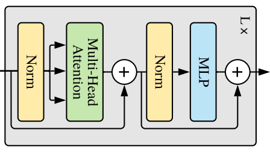
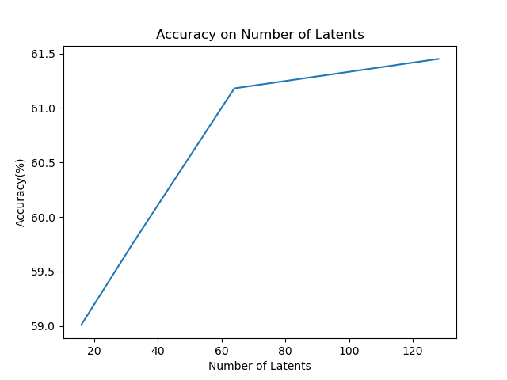
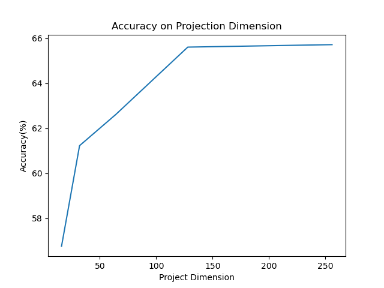

# Cifar-10 Dataset Classification with Perceiver

## Author
**Name:** Jeng-Chung, Lien 
**Email:** masa67890@gmail.com

## Table of Contents
* [Introduction](#introduction)
* [CIFAR-10 Dataset](#cifar-10-dataset)
* [Perceiver Model](#perceiver-model)
* [Perceiver Experiment](#perceiver-experiment)
* [Vision Perceiver Model](#vision-perceiver-model)
* [Vision Perceiver Experiment](#vision-perceiver-experiment)
* [Conclusion](#conclusion)
* [Future Work](#future-work)
* [Dependencies](#dependencies)
* [Reference](#reference)
* [Other Projects](#other-projects)

## Introduction
Transformers have been known to be powerful with the attention mechanism[[1]](#reference_anchor1), however it suffers from expensive computation in the domain of computer vision. Vision Transformer[[2]](#reference_anchor2), a transformer introduced by the google research and brain team uses patches of images to fit in the transformer model so images become possible for transformers. However, it is limited to images and patches of images. Hence, a model introduced by DeepMind, Perceiver is created[[3]](#reference_anchor3). Perceiver is a transformer model that attends to all the pixels of an image with the ability to scale down the computation to linear of the original transformer model mainly using cross-attention. Even more, it is introduced as not limited to any types of domains or inputs that could deal with images, audio, point clouds, and sequences like videos for classification. Here we will be demonstrating and experimentation the self-implemented Perceiver model with a small image dataset, Cifar-10[[4]](#reference_anchor4). We will be discussing the structure of the model, the original results of the Perceiver in the paper of imagenet, the results of Perceiver on small image dataset, the limitations of such model on small image dataset and a modification version of the Perceiver to perform better on small dataset.

## CIFAR-10 Dataset
The dataset to perform image classification here would be using the Cifar-10 dataset[[4]](#reference_anchor4). The Cifar-10 dataset was collected by Alex Krizhevsky, Vinod Nair, and Geoffrey Hinton. These data are a tiny subset from the 80 million tiny image dataset, which has 10 labeled classes(airplane, automobile, bird, cat, deer, dog, frog, horse, ship, truck). There is no additional pre-processing that is needed on these data, they are all in consistent sizes of 32x32x3. What is done is only using min-max scaling to scale the pixels from the range of 0-255 to 0-1. Here the dataset consists of 60000 images in total, where the dataset is split into 50000 as the train set and 10000 as the test set. Where there are 5000 images per class in the train set and 1000 images per class in the test set. Below are the examples of 10 random images in each class.

**CIFAR-10 Dataset Figure[[4]](#reference_anchor4):** 

##  Perceiver Model
The Perceiver Model is a transformer model architecture used for classification in multiple domains, like images, audio, point clouds, and sequences[[3]](#reference_anchor3). Below is the model structure from the original Perceiver paper. Here we will be first explaining the whole structure of the model architecture, then explaining the components of the model.

**Perceiver Model Figure[[3]](#reference_anchor3):** 

* **Perceiver Architecture**
For the Perceiver model architecture[[3]](#reference_anchor3), here we will be re-writing the terms and the Perceiver model image from the original paper so we have a more clear and detailed explanation. Below we will be explaining the usage of the Perceiver in two ways optionally in the terms of image classification domain. First architecture as Perceiver Stack, and the second architecture as Perceiver Iteration.

    * **Perceiver Stack**
    This architecture uses different cross attention following self attention transformers as a block and stack these blocks X times to add depth and complexity to the model, shown in the image below in more detail.
      **Perceiver Stack Figure:** 
      
    First it takes the latent array addition with a 1D learnable position embedding as the query ,and the original image concat with the 2D fourier features as the key and value. These are input into the first cross attention, then it outputs a new latent and would be input into the following self-attention transformer. Then the output from the first block could be used as a new query then input to a different cross attention following self-attention transformer with the original image addition with the 2D fourier features as the key and value. This could be stacked as multiple blocks up to X times to add depth and complexity to the model. The output of the last block then would be averaged over all the vectors of the sequences which would then have a single vector representation of the image to feed in the classifier. The classifier is a multilayer-perceptron(MLP) with sigmoid or softmax activation on the last layer to output the result of the classification.  
    For the time complexity of such a model in terms of input sequence size for the latent array where there are N sequences, the byte array where there are M sequences. The time complexity of the cross attention would be O(N*M), where M > N. For self attention it would be O(N^2). If we don’t ignore the depth of the model, the self-attention transformer here would be L stacks, which would be O(LN^2) for the self-attention transformers. Then for the whole model stacking the blocks X times, it would be O(X(N*M + LN^2)) as the time complexity. Mainly if we use the same amount of self-attention as the depth with O(M^2) it would be much less then the time complexity of simply using a full self-attention on raw image pixels.  
    For the space complexity of the model in the viewpoint of the memory is increased from zero, basically the toral parameter size of the model in memory. Here the space complexity would be O(X(N*M + LN^2)).
    
    * **Perciver Iteration**
    Different from the architecture above, the architecture here uses a Recurrent Neural Network(RNN) like structure to iterate on the same weights of a block to add depth and complexity to the model, shown in the image below in more detail.
      **Perceiver Iteration Figure:** 
      
    First it takes the latent array addition with a 1D learnable position embedding as the query ,and the original image concat with the 2D fourier features as the key and value. These are input into the first cross attention, then it outputs a new latent and would be input into the following self-attention transformer. Then the output from block 1(as the output of iter 1) could be used as a new query then input to a different cross attention following the same self-attention transformer from block 1 with the original image addition with the 2D fourier features as the key and value as block 1’. There are two different blocks, block 1 and block 1’. Only the first cross attention is different where all the other self-attention and cross attention(if exist) are using the same shared weights. In the original paper of Perceiver when experimenting on the imagenet dataset[[3]](#reference_anchor3), it is observed that the initial first cross attention generates a totally different attention map compared to all other cross attention so not sharing the same cross attention would have an increased performance. Here I would understand this as a phenomenon of where an initial random latent array is a general representation query on the trained dataset pattern that it generates a general query to search a meaningful query bias towards the current input image in the first initial cross attention to generate a new specific query to then later perform on later cross attentions.  
    Then in block 1’ it takes the output as a new query and inputs again like a RNN, this is repeated i-2 times. If i=1, the block 1 output is directly input to the average instead. Total iteration is i times, where one time is the initial different cross attention. The last output of the block 1’(iter i output) then would be averaged over all the vectors of the sequences which would then have a single vector representation of the image to feed in the classifier. The classifier is a multilayer-perceptron(MLP) with sigmoid or softmax activation on the last layer to output the result of the classification.  
    For the time complexity of such a model in terms of input sequence size for the latent array where there are N sequences, the byte array where there are M sequences. The time complexity of the cross attention would be O(N*M), where M > N. For self attention it would be O(N^2). If we don’t ignore the depth of the model, the self-attention transformer here would be L stacks, which would be O(LN^2) for the self-attention transformers. Then for the whole model iterating the block i times, it would be O(i(N*M + LN^2)) as the time complexity. If i=X from the Perceiver Stack architecture it would be the same time complexity.  
    However, from the view of space complexity. Where only the first initial cross attention is using a different weight other cross attention and self attention are using the same weight, the space complexity for such architecture would be O(2(N*M) + LN^2) which is much less than the space complexity of the Perceiver Stack architecture O(X(N*M + LN^2)) if same depth.
    
    * **Components**
    Here we will be explaining the components of the model, the latent array, the byte array, the 1D learnable position encoding, the fourier features, the self attention transformer, the cross attention transformer, average and MLP.
        * **Latent Array:** The latent array here is a learnable array, where there are N multiple vectors with dimension D. The latent array is initially random initialized and would learn and update on later training.
        * **Byte Array:** The byte array here is the original input of the data. In the term of image classification, the byte array would be M pixels with the dimension C as the RGB of the image.
        * **1D Learnable Position Encoding:** The 1D learnable position encoding is a vector with the same dimension D as the latent array. This vector is generate with a single layer of D neurons, where the inputs are one-hot vectors of numbers representing the sequence of the latent arrays where for N vectors of latent arrays there will be 1 to N as a one-hot vector to input into the single layer of D neurons to generate a learnable position encoding vector with dimension D. This is the same position encoding used in Vision Transformer.
        * **Fourier Features:** From the original paper of Perceiver[[3]](#reference_anchor3), here we define f_k as the frequency f_k of the k-th band, x_d as the raw position of the input along dimension d (eg. For an image d=2, coordinates of two dimension where ranges from 1 to -1), and mu as the target sampling rate(eg. For an image the sampling rate would be the max resolution as mu according to the dimension, like a 64x32 resolution for dimension 1 mu would be 64 and dimension 2 mu would be 32). Then we could define the fourier features formula as [sin(f_k * pi * x_d), cos(f_k * pi * x_d)], where the K bands of f_k would be an equally distributed frequency between 1 and mu/2 according to the dimension (known as the Nyquist frequency). Then the fourier features [sin(f_k * pi * x_d), cos(f_k * pi * x_d)] would be concat with the raw original positions x_d to get the final position encodings as a size of d(2K + 1).
        * **Self-Attention Transformer(Latent Transformer):** For the self-attention transformer the structure is shown at the figure below. It takes all the same input and passes through a layer normalization, then a multi-head attention. The output of the multi-head attention then is added with the initial input, then this is then input into a dense block mentioned in the Perceiver paper which basically is just a MLP. Before that it is passed through another layer normalization, then input into the MLP (the MLP is a structure of two linear layers with a gelu activation in between and dropouts afterwards). The final output of the structure then would take the output from the MLP and add it with the input before the layer normalization of the MLP. This whole transformer block then could be stacked L times to add depth and complexity.
          **Self-Attention Transformer Figure[[2]](#reference_anchor2):** 
          
        The multi-head attention here would be shown in the below figure on the right. It basically takes the QKV as the input and passes it through different linear layers to learn and transform it into the same dimension, then it is passed through the scaled dot-product attention. Since it is called multi-head there are h different heads of scaled dot-product attention and 3*h linear layers, so it picks up different features with each of the different h heads of attentions. The output of each of these h heads of attention then would be concat and passed through a linear layer as the output.
          **Multi-Head Attention Figure[[1]](#reference_anchor1):** 
          
        The Scaled Dot-Product Attention shown in the figure above on the left is written in the formula below. It takes the Q and K transpose as matrices and multiply them together, then it is scaled by the factor of the square root of the dimension of K. This then would optionally pass through a mask matrix where by adding -inf would be masking the information and 0 otherwise for learning sequence patterns. This then would go through a softmax to get the probability of how much attention it wants to put on each of the components of V which multiplied by V to get the final output of the Scaled Dot-Product Attention.
          **Scaled Dot-Product Figure[[1]](#reference_anchor1):** 
          
        * **Cross Attention Transformer:** Cross attention transformer basically has the same structure as the self-attention transformer, the only difference is that cross attention takes a different input as the query Q and searches on the different input as the key K where it is the same as the value V, shown in the figure below. The usage of cross attention transformers is that it takes a different query to find which important features on the other input relates the most on such a query and take these features as the output, where this could be used to find related relations on different structures or domains of inputs. Or it could be used to reduce the sequence dimensions of certain inputs shown in the Perceiver model.
          **Cross-Attention Transformer Figure:** 
          
        * **Average:** The average here takes the N different vectors of D dimension and averages it to a vector of D dimension as the vector representation of the image.
        * **MLP:** The MLP here is the classifier which simply is just a single layer of C classes of neurons to generate logits then pass through a sigmoid or softmax activation to get the probability of classes.
        
    * **Other:**
    To note in terms of the image classification usage of Perceiver model, the original image is first performed on a random crop then concat with the 2D fourier features shown in the below figure of (a) as the crop-relative coordinates. Different from applying the whole image with fixed coordinates as (b), random crops are performed with the same position grid structure but this adds more combination of the RGB pixels with the fourier features. In the original paper of Perceiver[[3]](#reference_anchor3), it mentioned using crops it introduces augmentation to position and aspect ratio, which mainly breaks the correlation of position features latching on to particular small pixels. Since they found the model overfitting with such a phenomenon, using random crops leads to a more general regularized model.
      **Crop and Image Coordinates Figure[[3]](#reference_anchor3):** 
      
    
## Perceiver Experiment
Here we will be performing the experiment using different hyperparameters, number of blocks (cross attention transformer following self-attention transformer as a block), number of stacks (the number L in self-attention transformer mentioned in the Components of Perceiver Model section), number of iterations (the number i of iterations mentioned in the Perceiver Stack of Perceiver Model section), the number of latents (the number of sequence N of latent array), and the projection dimension (the D neurons of each of the linear layers through the whole network). First we will perform with small numbers to get a grasp of how each of the hyperparameters work on a small dataset, then we will train a model using more optimal hyperparameters to see how good the performance is. Different from the original Perceiver paper, which they perform on a medium dataset imagenet, here we are experimenting on a small dataset Cifar-10[[4]](#reference_anchor4) to see how the model would perform.  
Here we used some of the same settings on all the perceiver models structure and training parameters shown below:
**-Cross Attention Heads:** 1 head
**-Self-Attention Heads:** 8 heads
**-Number of Frequency Bands:** 5 bands (increase of bands here would lead to worse performance)
**-Random Crop Size:** 28x28
**-Dropout Probability:** 0.1 through the whole network
**-Optimizer:** LAMB optimizer without weight decay
**-Learning mode:** A step learning rate decay(initial 0.001, end 0.00000001)
**-Batch size:** Using batch size of 20 to train
**-Epochs:** Using 50 epochs to train
**-Loss Function:** Sparse Categorical Cross Entropy
**-Evaluation Metric:** Top-1 Accuracy

* **Hyperparameter Testing**
    * **Accuracy on Blocks and Stacks**
    Here we perform multiple models using the combination of the parameters of blocks 1, 2, 4, and stacks, 0, 1, 2, 4 shown in the figure below. Other parameters are all fixed in these models, the number of latents is 32, the projection dimension is 32, and the iteration is 1. From the figure below we can see that no matter how many blocks are used the more stacks of the self-attention transformer after a certain threshold leads the model to perform worse, but by using one self-attention transformer instead of not using any leads to a boost of performance. It is also interesting to see that the increase of cross attentions doesn’t guarantee a boost of performance while the more cross attentions after a certain threshold could also lead to a worse performance with different stacks.
      **Accuracy on Blocks and Stacks Figure:** 
      
    * **Accuracy on Iterations and Stacks**
    Here we perform multiple models using the combination of the parameters of iterations 1, 2, 4, and stacks, 0, 1, 2, 4 shown in the figure below. Other parameters are all fixed in these models, the number of latents is 32, the projection dimension is 32, and the number of blocks is 1. From the figure below similar to the accuracy on blocks and stacks we can see that no matter how many iterations are used the more stacks of the self-attention transformer after a certain threshold leads the model to perform worse, but by using one self-attention transformer instead of not using any leads to a boost of performance. It is also interesting to see that the increase of iterations doesn’t guarantee a boost of performance while the more iterations after a certain threshold could also lead to a worse performance with different stacks.
      **Accuracy on Iterations and Stacks Figure:** 
      
    * **Accuracy on Number of Latents**
    Here we perform the experiment on multiple models with different numbers of latents as 16, 32, 64, and 128 shown in the figure below. Other parameters are all fixed in these models, the projection dimension is 32, the number of blocks is 1, the number of stacks is 1, and the number of iterations is 1. Here we can see that by increasing the number of latents there is an increase in the accuracy and probably would flatten out. However, to note that in the original paper of Perceiver[[3]](#reference_anchor3), the accuracy on imagenet first increases when increasing the number of latents, then by passing some threshold the accuracy starts decreasing.
      **Accuracy on Number of Latents Figure:** 
      
    * **Accuracy on Projection Dimension**
    Here we perform the experiment on multiple models with different numbers of projection dimensions as 16, 32, 64, 128, and 256 shown in the figure below. Other parameters are all fixed in these models, the number of latents is 32, the number of blocks is 1, the number of stacks is 1, and the number of iterations is 1. Here we can see that by increasing the number of projection dimensions there is an increase in the accuracy and probably would flatten out.
      **Accuracy on Projection Dimension Figure:** 
      
    
* **Optimal Parameter Model**
From the hyperparameter testing experiment, we then could get a grasp of how we want to set the optimal parameter for the model. However, for accuracy on blocks and stacks, versus the accuracy on iterations and stacks is quite similar, so we would also perform different hyperparameters for the blocks and stacks, compared to the iterations and stacks.
    * **Optimal Accuracy on Blocks and Stacks**
    Since the more latents the better performance which seems to have a more boost on accuracy it is set to 256, and since the projection dimension doesn't have much difference from 128 and 256 it is set to 128 to save training time. Here four models are trained by using these fixed settings on the number of latents and the number of projection dimensions, with other settings, and the number of iteration is 1. The different hyperparameters are using the number of blocks of 1, 2, and number of stacks of 1, 2. Here we can see that by increasing the number of blocks or stacks all lead to a worse performance.
      **Accuracy on Blocks and Stacks for Perceiver_256_128 Figure:** 
      
    * **Optimal Accuracy on Iterations and Stacks**
    Since the more latents the better performance which seems to have a more boost on accuracy it is set to 256, and since the projection dimension doesn't have much difference from 128 and 256 it is set to 128 to save training time. Here four models are trained by using these fixed settings on the number of latents and the number of projection dimensions, with other settings, and the number of blocks is 1. The different hyperparameters are using the number of iterations of 1, 2, and number of stacks of 1, 2. Here we can see that similar to the accuracy on blocks and stacks by increasing the number of iterations or stacks all lead to a worse performance. However, comparing all the models the increase on number of iterations versus increase on number of blocks, the increase on number of iterations have a slightly better performance. Also it is noted that in the original Perceiver paper[[3]](#reference_anchor3), they mentioned that increasing iterations rather than blocks to increase the model complexity would lead to a more general model.
      **Accuracy on Iterations and Stacks for Perceiver_256_128 Figure:** 
      
    
* **Best Perceiver Model and Conclusion**
Here we list the table of the optimal parameter model accuracy below with the model name as the format of Perceiver_{latent_num}_{proj_dim}_{block_num}_{stack_num}_{iter_num}.
    
    |          Model          | Accuracy(%) |
    |:-----------------------:|:-----------:|
    | Perceiver_256_128_1_1_1 |    68.53    |
    | Perceiver_256_128_1_2_1 |    67.36    |
    | Perceiver_256_128_2_1_1 |    65.89    |
    | Perceiver_256_128_2_2_1 |    64.02    |
    | Perceiver_256_128_1_2_1 |    67.36    |
    | Perceiver_256_128_1_1_2 |    66.45    |
    | Perceiver_256_128_1_2_2 |    64.89    |

    Here we can see the best model in this experiment is the model Perceiver_256_128_1_1_1 with the accuracy of 68.53%. Since we didn’t use any weight decay, by adding the depth and model complexity would lead the model too complex on such a small dataset and perform worse. It is also possible that since the latent array is a learnable array, which are general vector representation search queries of the training data. Where on small dataset it probably would be representing as queries too bias to the training data since the sample isn’t large enough, compare to the original paper of Perceiver[[3]](#reference_anchor3) where they trained the model on imagenet it performed better since it is a much larger size of dataset that the latent array could represent a much general scope of queries so it performs better on larger datasets and much worse on small datasets.

## Vision Perceiver Model
Here I introduce a modified version of the Perceiver model, called Vision Perceiver as I named it myself shown in the figure below. As mentioned before in the experiment on small dataset with Perceiver, the learnable latent array is too biased to the training data where if the dataset isn’t large enough it wouldn’t perform well. Hence, here instead of using a learnable latent array, I would be using the component of linear projections of flatten patches from the Vision Transformer model[[2]](#reference_anchor2). Here these linear projections of flatten patches could have any dimension D and the multiple vectors N, where N < M that is same as the latent array so the time complexity of the cross attention still holds. Here the linear projections of flatten patches would be the information from the current input rather than a representation query that is learned from training data, so it would perform better on small datasets.

**Vision Perceiver Model Figure:** 

First the original image which is the byte array still would be processed through a random crop before concating with the 2D fourier features and also before taken into the process of the linear projections of flatten patches. After the random crop, the crop image then would be concat with the 2D fourier features and input to the first cross attention transformer as the key and value. The crop image would also be processed to the linear projections of flatten patches, which is basically separating the image into patches with convolution. Each of these patches then would be fed into a linear layer so it transforms these patches into a learnable embedding of patches. These embeddings then would add with a 1D learnable position encoding and input to the first cross attention transformer as the query.

The initial cross attention output iter 1, then would be fed into the self-attention transformer if the total iteration is equal to 1. Otherwise if the total iteration is greater than 1, it would be input into a second cross attention transformer as the query and the output of the second cross attention transformer would be input into the same cross attention transformer repeating this i-2 times. Then after all the iterations the output then would be input into a self-attention transformer, and it would be averaged over all the vectors of the sequences which would then have a single vector representation of the image to feed in the classifier. The classifier is a multilayer-perceptron(MLP) with sigmoid or softmax activation on the last layer to output the result of the classification.

## Vision Perceiver Experiment
In this section, we will be experimenting with the vision perceiver model with different parameters and methods. At first, the vision perceiver model is designed the same as the perceiver stack mentioned in the perceiver model. However, we found out that different from the perceiver model where the original paper mentioned that placing a self-attention transformer between the cross-attention will have better performance[[3]](#reference_anchor3), the vision perceiver will have a better performance by placing all the cross-attention at start then a self-attention. This is probably due to the different features the query is representing and learning so the performance differs from such structure. We also perform the same as the perceiver stack, stacking different cross-attention instead of iterating it in the vision perceiver model. The iteration of the vision perceiver would have a better generalization and wouldn’t overfit much compared to the stack version of it, this is similar to the iteration version of the perceiver mentioned in the original paper that it generalizes better by iterating[[3]](#reference_anchor3). Hence we use the model mentioned above as the vision perceiver(modified perceiver model) to test different parameters and methods, where we found that by using one self-attention transformer and four iterations only (due to limited hardware computation) it has the best performance. First we will be training the model directly with such a setting. Then we will perform data augmentation to see how much we could improve the model. Last, we will be adding weight decay and adding the dimension of the model to see how we could boost the performance.

Here we used some of the same settings on all the vision perceiver models structure and training parameters shown below:
**-Cross Attention Heads:** 1 head
**-Self-Attention Heads:** 8 heads
**-Self-Attention Stacks:** 1 stack
**-Total Iterations:** 4 iteration
**-Number of Frequency Bands:** 5 bands (increase of bands here would lead to worse performance)
**-Random Crop Size:** 28x28
**-Patch Size:** 4x4
**-Stride:** 2 pixels
**-Number of Latents(Calculated from patch size and stride, which is fixed):** 169
**-Dropout Probability:** 0.1 through the whole network
**-Learning mode:** A step learning rate decay(initial 0.001, end 0.00000001)
**-Batch size:** Using batch size of 20 to train
**-Loss Function:** Sparse Categorical Cross Entropy
**-Evaluation Metric:** Top-1 Accuracy

First, by training the model with 128 projection dimension, 50 epochs, and LAMB optimizer without weight decay we could get a model accuracy around 75%. Then by using data augmentation where we randomly flip the image horizontally and shift the image 10% around filling the missing pixels with reflection with the same epoch and optimizer, we could get a model accuracy around 77% which is a 2% improvement. Last, by using data augmentation, adding a weight decay of 0.1, changing the dimension to 256, and training with 200 epochs we could get a model accuracy of 82.52% and should increase more if trained with more epochs. The table of results shown below, where comparing the accuracy of the perceiver model and vision perceiver, the vision perceiver has an improvement of 14% with such a method on this small dataset. The vision perceiver model is named as the structure of ViP_{latent_num}_{proj_dim}_{stack_num}_{iterations}.

|                Model                | Accuracy(%) |
|:-----------------------------------:|:-----------:|
|       Perceiver_256_128_1_1_1       |    68.53    |
|          ViP_169_128_1_1_4          |      75     |
|   ViP_169_128_1_1_4(Augmentation)   |      77     |
| ViP_169_256_1_1_4(Aug+Weight Decay) |    82.52    |

## Conclusion
In this project we explained the perceiver model[[3]](#reference_anchor3). Mainly the component of cross-attention so it could be used as a component without expensive computation as self-attention taking the whole data itself. We mentioned how the perceiver model works in the context of the image classification domain, and also demonstrate how the model hyperparameters and performance is on a small dataset. We found that the learnable latent in the perceiver model wouldn’t work well on small dataset due to its bias to the training data where the dataset size is too small for it to represent a general latent query. Hence, here we also introduce a modified version of perceiver, Vision Perceiver. Taking components of a vision transformer[[2]](#reference_anchor2) and combining it with a perceiver without increasing the computation to perform the model on a small dataset. Due to the learnable latent doesn’t work well on small datasets, we changed it to embeddings that contain the information of the input image as the query so it would work better on small datasets. Perceiver is an extremely flexible model that could take images, audio, point clouds or even other types of data. However, these are all limited to classification or outputting some small dimension. Therefore, it would be interesting to see how such a model would transform into a more flexible model that could deal with outputting more or higher dimensions, like image segmentation tasks. It is also interesting to see if the vision perceiver could improve even more on small dataset, since there is also a component in the model that assumes a general distribution or large dataset to work well, which is the average component in this model.

## Future Work
* **PerceiverIO[[5]](#reference_anchor5):** Perceiver IO is a model that is even more extremely flexible where it is using the same concept of the perceiver model. This is a model that was introduced by some of the authors who created the perceiver model with additional members. Perceiver model has a encoder and decoder part, where encoder is the part of the perceiver model removing the average and mlp. The decoder is using cross-attention by taking the latent array instead of it as a query, it is taken as the key and value. Then a higher dimension output would take a higher dimension as the query, so this forms the decoder. We would like to see how this model would perform on an image segmentation task.

* **Compact Transformers[[6]](#reference_anchor6):** Compact transformers are introduced in the paper “Escaping the Big Data Paradigm with Compact Transformers”. They tested the original vision transformer, compact vision transformer and compact convolutional transformer. The compact transformers work really well on small datasets not like the original vision transformer that works extremely well when the data is large. This is due to a component in a compact transformer called sequence pooling. With sequence pooling, it works quite like a learnable weighted average where we would replace the average component in vision perceiver using this part to see how it would boost the performance on a small dataset. We would like to see how it would work on vision perceiver and also try to improve the model by only using transformers without any convolutional neural networks components and see if it could outperform models that include convolutional neural networks training from scratch on small datasets.

## Dependencies
* Python 3.7
* Tensorflow 2.3.0
* Tensorflow-addons 0.13.0

## Reference
[1] A. Vaswani, N. Shazeer, N. Parmar, J. Uszkoreit, L. Jones, A. N. Gomez, L. Kaiser, and I. Polosukhim, "Attention Is All You Need", Dec. 2017. [Online]. Available: [https://arxiv.org/abs/1706.03762](https://arxiv.org/abs/1706.03762)  
[2] A. Dosovitskiy, L. Beyer, A. Kolesnikov, D. Weissenborn, X. Zhai, T. Unterthiner, M. Dehghani, M. Minderer, G. Heigold, S. Gelly, J. Uszkoreit, and N. Houlsby, “An Image is Worth 16x16 Words: Transformers for Image Recognition at Scale”, Jun. 2021. [Online]. Available: [https://arxiv.org/abs/2010.11929](https://arxiv.org/abs/2010.11929)  
[3] A. Jaegle, F. Gimeno, A. Brock, A. Zisserman, O. Vinyals, and J. Carreira, "Perceiver: General Perception with Iterative Attention", Jun. 2021. [Online]. Available: [https://arxiv.org/abs/2103.03206](https://arxiv.org/abs/2103.03206)  
[4] A. Krizhevsky, V. Nair, and G. Hinton, "The CIFAR-10 dataset", [Online]. Available: [https://www.cs.toronto.edu/~kriz/cifar.html](https://www.cs.toronto.edu/~kriz/cifar.html)  
[5] A. Jaegle, S. Borgeaud, J. Alayrac, C. Doersch, C. Ionescu, D. Ding, S. Koppula, D. Zoran, A. Brock, E. Shelhamer, O. Hénaff, M. M. Botvinick, A. Zisserman, O. Vinyals, and J. Carreira, "Perceiver IO: A General Architecture for Structured Inputs & Outputs", Mar. 2022. [Online]. Available: [https://arxiv.org/abs/2107.14795](https://arxiv.org/abs/2107.14795)  
[6] A. Hassani, S. Walton, N. Shah, A. Abuduweili, J. Li, and H. Shi, "Escaping the Big Data Paradigm with Compact Transformers", Jun. 2022. [Online]. Available: [https://arxiv.org/abs/2104.05704](https://arxiv.org/abs/2104.05704)

## Other Projects
1. ISICs Dataset Segmentation with Improved UNet. [Github Link](https://github.com/shakes76/PatternFlow/tree/topic-recognition/recognition/Segmentation-ISICs-ImprovedUnet-s4623205)
2. Cifar-10 Classification with Vision Transformer. [Github Link](https://github.com/cloudstrife1117/VisionTransformer)